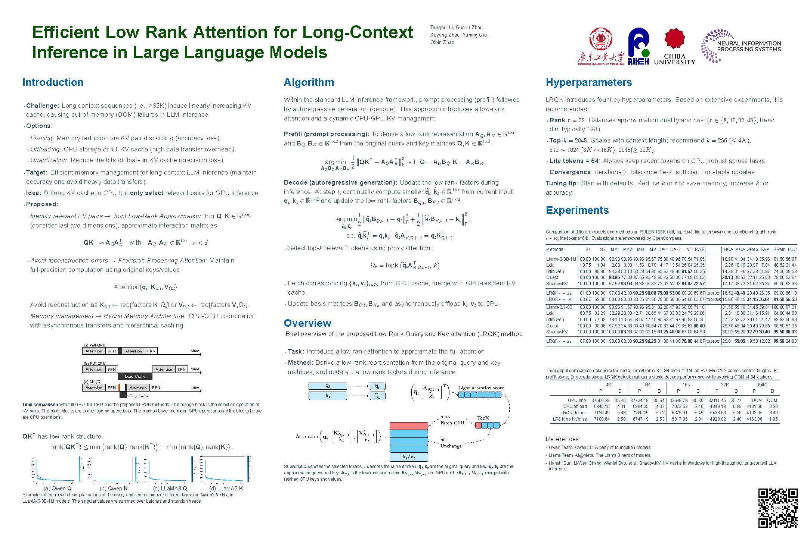

# Efficient Low Rank Attention for Long-Context Inference in Large Language Models



[Paper Link](https://arxiv.org/abs/2510.23649) | [NeurIPS Presentation](https://neurips.cc/virtual/2025/loc/san-diego/poster/118451) | [Project Poster](./poster/poster-dpi300-1.png)

## Overview

This repository contains the official implementation of the Low-Rank Query-Key (LRQK) attention mechanism, designed to efficiently handle long-context inference in Large Language Models. As the length of input text increases, the key-value (KV) cache in LLMs imposes prohibitive GPU memory costs and limits long-context inference on resource constrained devices. Existing approaches, such as KV quantization and pruning, reduce memory usage but suffer from numerical precision loss or suboptimal retention of key-value pairs. 

LRQK addresses these challenges through a two-stage framework that jointly decomposes full-precision query and key matrices into compact rank-r factors during the prefill stage, and then employs these low-dimensional projections to compute proxy attention scores in O(lr) time at each decode step. By selecting only the top-k tokens and a small fixed set of recent tokens, LRQK employs a mixed GPU-CPU cache with a hit-and-miss mechanism where only missing full-precision KV pairs are transferred, thereby preserving exact attention outputs while reducing CPU-GPU data movement.

## Features

- **Efficient Memory Usage**: Dramatically reduces KV cache memory requirements using low-rank approximations
- **Scalable Long-Context Processing**: Enables inference on sequences with hundreds of thousands of tokens
- **Multi-Model Support**: Compatible with popular architectures including Llama, Qwen2, Mistral
- **Flexible Configuration**: Adjustable rank parameters and cache strategies for different use cases
- **Hit/Miss Optimization**: Intelligent caching strategy to minimize GPU-CPU transfers

## Requirements

We tested the code on the following environment:

- Python: 3.10.16
- PyTorch: 2.5.1
- HuggingFace Hub: 0.24.7
- Transformers: 4.47.1
- OpenCompass: 0.3.9 (install via source code from [opencompass.git](https://github.com/open-compass/opencompass.git); commit id: 7f2aeeff26bf550563092e8368bf63d5526fae26))
- WonderWords: 2.2.0 (for RULER benchmark)

There is a C++/CUDA plugin that needs to be compiled:
```bash
cd cpp_kernel
make
```

## Installation

1. Clone the repository with submodules:
```bash
git clone --recurse-submodules https://github.com/your-repo/TensorKVCache.git
cd TensorKVCache
```

2. Install the required dependencies:
```bash
pip install -r requirements.txt  # if available, otherwise install manually
```

3. Compile the C++/CUDA kernels:
```bash
cd cpp_kernel
make
cd ..
```

## Quick Start

Try the LRQK attention mechanism with a simple example:

```bash
python quick_demo.py
```

For a more detailed demonstration:

```bash
python demo_lrqk.py
```

## Usage

### Basic Usage

The LRQK cache can be integrated into any Hugging Face transformer model:

```python
from lrqk_attention import DynamicLRQKCache, load_model

# Load model with LRQK attention
model, tokenizer = load_model(
    "Qwen/Qwen2.5-7B-Instruct",
    lrqk=True,
    device="cuda:0"
)

# Use the LRQK cache during generation
cache = DynamicLRQKCache(
    r=32,                    # Rank of low-rank approximation
    num_active_tokens=2048,  # Number of active tokens to keep in GPU
    lite_tokens=64,          # Number of most recent tokens to always keep
    max_iter=(2, 2),         # Max iterations for prefill/decode optimization
    tol=1e-8,                # Tolerance for convergence
    init_aq_ak_method='randn' # Initialization method for A_Q and A_K
)

# Generate with LRQK cache
inputs = tokenizer("Your long input here...", return_tensors="pt").to(model.device)
outputs = model.generate(
    **inputs,
    max_new_tokens=100,
    past_key_values=cache,
    do_sample=True
)
```

### Advanced Configuration

The LRQK cache supports various configurations for different use cases:

```python
from lrqk_attention import DynamicLRQKCache, LightAttentionIndicesOffloadPrefill

# For memory-constrained environments
cache = DynamicLRQKCache(
    r=16,                    # Lower rank for reduced memory
    num_active_tokens=1024,  # Fewer active tokens
    lite_tokens=32,
    max_iter=(1, 1),         # Fewer iterations for speed
    lwattn_factory=LightAttentionIndicesOffloadPrefill,  # Offload during prefill
)

# For accuracy-focused applications
cache = DynamicLRQKCache(
    r=64,                    # Higher rank for better approximation
    num_active_tokens=4096,  # More active tokens
    lite_tokens=128,
    tol=1e-10,               # Tighter convergence tolerance
    max_iter=(4, 4),         # More iterations for precision
)
```

## Evaluation

The project includes comprehensive evaluation tools using OpenCompass:

```bash
# Set GPU devices
export CUDA_VISIBLE_DEVICES=0,1,2,3

# Run evaluation with specific config
python ./opencompass_run.py --reuse "latest" ./eval_configs_lrqk/eval_seq_ruler128k.py

# Or run with different configurations
python ./opencompass_run.py --reuse "latest" ./eval_configs_lrqk/eval_seq_longbench.py
```

Results are saved in the `./outputs` directory.

## Architecture

### Core Components

1. **Low-Rank Approximation**: The core innovation that approximates attention computation using low-rank decompositions Q ≈ A_Q × B_Q and K ≈ A_K × B_K.

2. **Dynamic Cache Management**: Intelligent cache that keeps only the most relevant tokens in GPU memory while storing the rest on CPU.

3. **Hit/Miss System**: Optimizes GPU-CPU transfers by predicting which tokens are most likely to be accessed.

4. **CUDA Optimizations**: Custom CUDA kernels for efficient tensor operations.

### Key Files

- `lrqk_attention.py`: Main implementation of LRQK attention mechanism
- `cpp_kernel/`: Custom CUDA/C++ kernels for performance
- `demo_lrqk.py`: Example usage of the LRQK cache
- `opencompass_run.py`: Integration with OpenCompass evaluation framework
- `eval_configs_lrqk/`: Evaluation configurations

## Web Visualization

An additional WebUI is provided for visualizing the attention changes:

```bash
# Set visible device if needed
export CUDA_VISIBLE_DEVICES=0
# Run the webui
uvicorn webui_attention_track:app --host 0.0.0.0 --port 8089
```

Access the web UI at `http://localhost:8089/`. Note: package `uvicorn` is required. Install it via `pip install uvicorn`.

## Reference Datasets

For better debugging, additional reference datasets are provided in [datasets_ref](./datasets_ref/). These datasets are collected from RULER and Wikitext.
Alternatively, we can generate them via OpenCompass with empty settings.

```bash
# We use a model that returns an empty string "" for all inputs, so that we can get the datasets.
# Please adjust the configuration based on the requirements.
./opencompass_run.py -w <output_of_dataset> ./eval_configs_lrqk/eval_seq_rulers_empty.py
```

## Contributing

We welcome contributions to the LRQK project! Here are some ways you can contribute:

1. Report bugs and issues
2. Suggest new features
3. Submit pull requests for bug fixes and enhancements
4. Improve documentation
5. Add support for new model architectures

## License

This project is licensed under the terms specified in the LICENSE file.

## Citation

If you use this code in your research, please cite our paper:

```
@inproceedings{Li2025LRQK,
  title = {Efficient Low Rank Attention for Long-Context Inference in Large Language Models},
  author = {Yuning Qiu and Qibin Zhao and Guoxu Zhou and Tenghui Li and Xuyang Zhao},
  journal = {Thirty-ninth Annual Conference on Neural Information Processing Systems (NeurIPS)},
  year = {2025},
  month = {12},
  url = {https://openreview.net/forum?id=Mc0eJHZhW5},
}
```